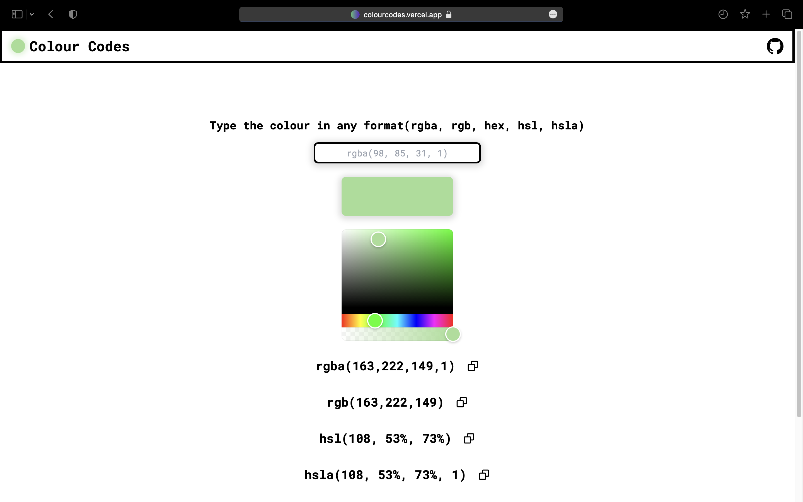

# Colour Codes



[Colour Codes](https://colourcodes.vercel.app) is a powerful color conversion app built with Next.js, TypeScript, and Tailwind CSS. It provides a seamless and efficient solution for converting colors between various formats, including RGBA, RGB, HSL, HSLA, and Hex. With support for Tailwind colors, Colour Codes enables designers, developers, and artists to explore, transform, and perfect their color palettes with ease.

## Features

- **Effortless Color Conversion:** Convert colors between RGBA, RGB, HSL, HSLA, and Hex formats effortlessly.
- **Tailwind Color Support:** Seamlessly integrate with Tailwind CSS and leverage its extensive color palette.
- **User-Friendly Interface:** Enjoy a sleek and intuitive interface designed to enhance your workflow.
- **Precise Color Translations:** Achieve precise color translations for consistency across different platforms.

## Technologies Used

- **Next.js:** A React framework for building fast and scalable web applications.
- **TypeScript:** A statically typed superset of JavaScript that enhances development productivity.
- **Tailwind CSS:** A utility-first CSS framework for creating custom designs with ease.

## Getting Started

To get started with Colour Codes, follow these steps:

1. **Clone the repository:**
   ```
   git clone https://github.com/your-username/colour-codes.git
   ```

2. **Install dependencies:**
   ```
   cd colour-codes
   npm install
   ```

3. **Run the development server:**
   ```
   npm run dev
   ```

4. **Open Colour Codes in your browser:**
   ```
   http://localhost:3000
   ```

## Contributing

We welcome contributions from the community! If you have any ideas, suggestions, or bug reports, please feel free to open an issue or submit a pull request.

To contribute to Colour Codes, follow these steps:

1. Fork the repository and create your branch:
   ```
   git checkout -b my-feature
   ```

2. Make your changes and commit them:
   ```
   git commit -m "Add my feature"
   ```

3. Push your changes to your forked repository:
   ```
   git push origin my-feature
   ```

4. Open a pull request in the main repository and describe your changes.

## License

This project is licensed under the [MIT License](LICENSE).

## Acknowledgments

Start exploring the world of color conversion and unleash your creativity with Colour Codes! If you have any questions or need assistance, please don't hesitate to reach out.

Happy coding!
Yug Bhanushali